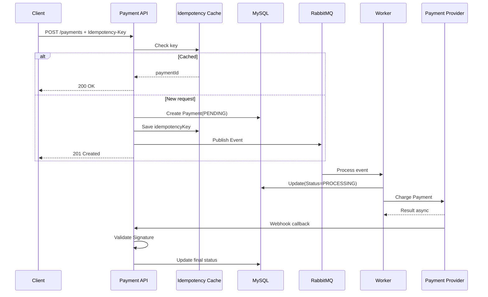

# Payment Service (Spring Boot)

A **sample Payment Service** demonstrating best practices for building scalable, reliable, and secure backend payment workflows.

## This service implements:

- **Idempotent POST /payments** using `Idempotency-Key` headers
- **Async processing** with RabbitMQ (worker architecture)
- **Secure webhook handling** with HMAC signature verification (theoretical payment provider)
- **Reliable processing** with retries and Dead Letter Queue (DLQ)
- **Persisted audit log** of payment events in MySQL
- **In-memory caching** for idempotency keys using **Caffeine**

**Tech Stack:**  
Java 25 | Spring Boot | Spring Data JPA | RabbitMQ | MySQL | Caffeine
---

## Architecture Overview
### Payment Service Workflow (UML Sequence Diagram)

### Payment Service Workflow (UML Sequence Diagram)

Quick start:
1. `docker-compose up -d`
2. `mvn spring-boot:run`
3. POST /api/payments (include header `Idempotency-Key`) -> returns paymentId
4. Simulate provider webhook: POST /api/webhooks/payment-provider with valid signature -> updates payment status

DEV snippets:
DB
`docker run -d -p 3306:3306 -e MYSQL_ROOT_PASSWORD=password mysql:9.5.0`

Rabbit-MQ
`docker run -d --name rabbitmq-server -p 5672:5672 -p 15672:15672 rabbitmq:management`
username & password = guest

Generating data : run
`chmod +x generate_data.sh`
then
`./generate_data.sh <number_of_requests>`

Out of scope for now:
- Authentication/Authorization
- Real payment provider integration
- Comprehensive error handling/logging
- Deployment scripts/CI-CD
- Monitoring/metrics
- Tests(All levels)